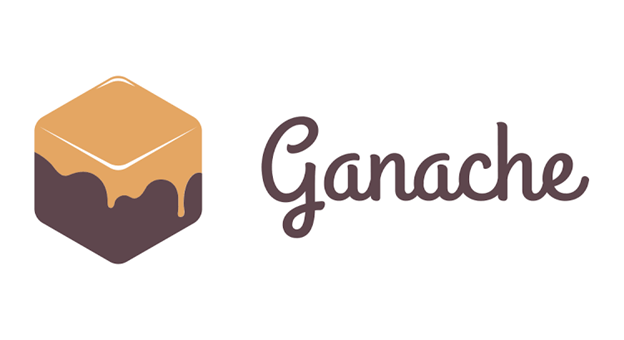
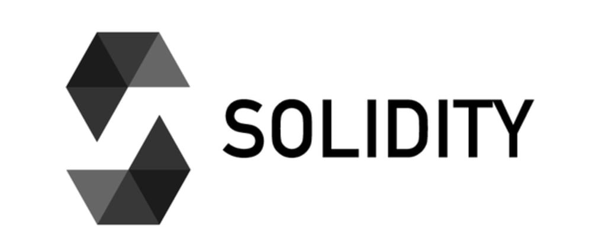
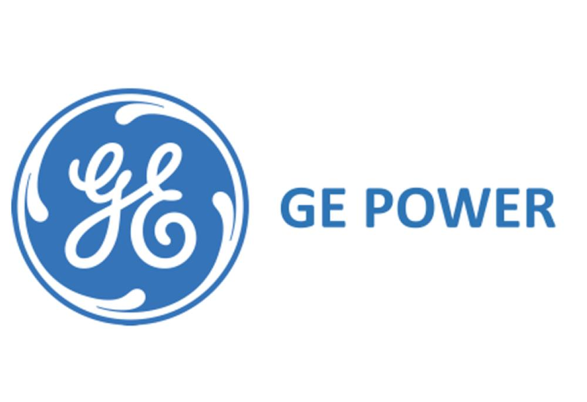
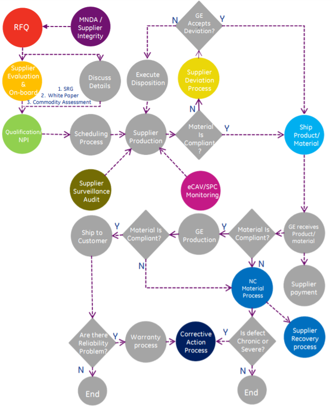

# Supply-Chain-dAPP
<h1 align="center">
  <br>
  <a></a>
  <br>  
  Supply-Chain-Dapp
  <br>
</h1>

<p align="center">
  
  <a href="https://github.com/trufflesuite/ganache-cli">
    
  </a>
  <a href="https://soliditylang.org/">
           
  </a>
  <a href="https://www.trufflesuite.com/">
    
  </a>
   &nbsp;&nbsp;&nbsp;
  <a href="https://www.npmjs.com/package/web3">
    
  </a>
  <a>
    
  </a>
  <a>
    
  </a>
</p>

<h4 align="center">A Supply Chain setup for GE Power Integrated Supply Chain Process.</h4>

<p align="center">
  <a href="#description">Description</a> •
  <a href="#architecture">Architecture</a> •
  <a href="#flow">Flow</a> •
  <a href="#working">Working</a> •
  <a href="#installation-and-setup">Installation and Setup</a> •
  <a href="#license">License</a>
</p>

## Description
A blockchain supply chain can help participants record price, date, location, quality, certification, and other relevant information to more effectively manage the supply chain. The availability of this information within blockchain can increase traceability of material supply chain, lower losses from counterfeit and gray market, improve visibility and compliance over outsourced contract manufacturing, and potentially enhance an organization's position as a leader in responsible manufacturing.
<p align="centre">  
      
</p>

## Architecture
The smart contract is being written with Solidity which is then compiled, migrated and deployed using Truffle.js on the local blockchain network created using Ganache. Testing of contract is performed by writing test code in java script by adding participants and products,deployed using Truffle.js on the local blockchain network created using Ganache. 

## Flow
<p align="centre">  
      
</p>

## Working
<p>
  The first step we take with any prospective supplier is to obtain a signed Non-Disclosure Agreement (NDA) between GE and the supplier.Once the NDA is on file, we can send the supplier a Request For Quote (RFQ). Having identified a candidate company, we take steps to assess the supplier’s capabilities, according to our formalized Supplier Evaluation & On-boarding Process. Once we have determined the appropriateness of forming a commercial relationship with the supplier, we can initiate our Qualification/New Product Introduction (NPI) process, which helps ensure that the products made by that supplier will be right the first time and every time. If at any point prior to shipment the supplier identifies a nonconformant condition that it believes may still be acceptable, the supplier can request permission to ship the product, despite its condition, through our Supplier Deviation Process. Once ready, products are transported to our facility in compliance with the requirements of our Shipping Process, which includes requirements related to packaging, bar coding and other activities. If a non-conformance is found after a product has been shipped, a Non-conformance Material Report will be written against it as part our Non-conformance Material Process. In cases in which a supplier’s defects have significantly adverse consequences, the Supplier Recovery Process may be employed. If the non-conformances are severe or chronic, the issue may be more formally addressed with our Corrective Action Process. Throughout the relationship, our eCAV Monitoring/SPC Process (as applicable, specific to products) helps suppliers continually strive for improvements that achieve higher levels of customer success. The Supplier Surveillance Audit Process likewise ensures a continued focus on quality improvement to support customer success.
</p>


## Installation and Setup
Prerequisites : `npm, git, truffle suite, Ganache, VS Code`


Install dependencies
```Bash
truffle init
npm install
git init
```
Install ganache
```Bash
Can be installed externally.
```
Configure ganache for 10 accounts and extend gasLimit to 6721975000 and beyond, so as to have enough gas for migrating the smart contracts and a data flow for the prototype.  

Install all packages in the package.json file
```Bash
npm i
>> change the local port number.
```

Run the app
```Bash
truffle deploy
```
Test the app
```
truffle console
>>Add command lines from test.txt file in command terminal in specified order.
>>Replace addresses in test.txt with addresses from your local ganache blockchain.
```
The app gets hosted by default at port 7545.


## License
This project uses an [MIT](https://opensource.org/licenses/MIT) license.
